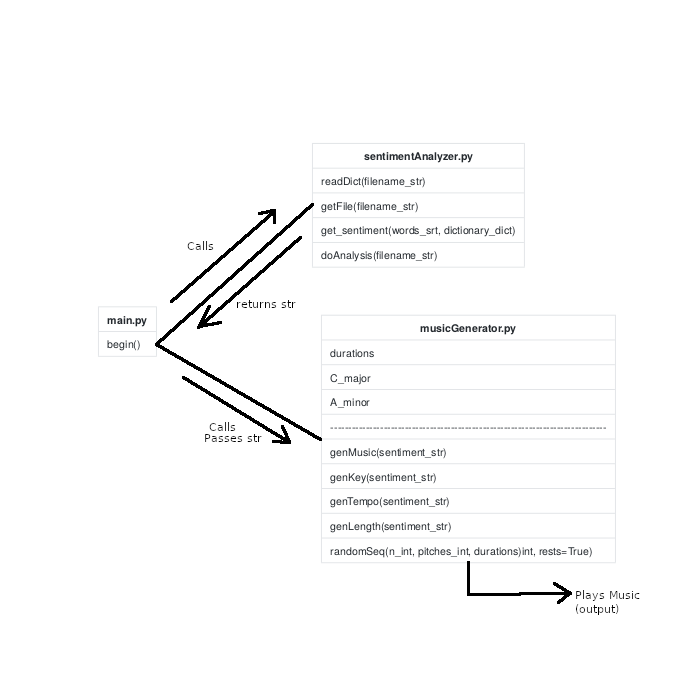

# Final Report

## Date: 10 Dec 2018
## Group Names: Jonathan Mendez, John Scott, Matthew Jones, Carson Quigley

## Report:

### Introduction and Motivation:

The project that our group chose to create was a way to represent text as music
passages. This program allows users to input text files, and uses a variety of
Python methods and packages to create a short audio summary which changes based
on the overarching mood of any text.

The biggest motivation for this project stems from each team members’ personal
interests in music. Every person in the “We Code Good” team is involved with
music at Allegheny College, either playing in various ensembles, or pursuing music
as an academic focus. This experience gave our group knowledge of an area not
often utilized in the field of computer science, which we wished to include in
our project. The other motivation for our project was the sentiment analysis
technique, as discussed in class. Many of our preliminary ideas included sentiment
analysis in some capacity, which led us to the challenge of creating a tool that
would be driven by text mood evaluation, while incorporating musical elements.
In the end, we decided to use sentiment analysis to find an overall mood value
from any text, and then write a randomly generated musical passage from the context
of the text. The created music passage would reflect the contents of the inputted
text file, by changing the number of notes, musical mode (major/minor), and tempo
based on if the text was calculated to be happy or sad, overall. Apart from the
criteria gathered from the sentiment analysis, the musical sequence would change
from one iteration to the next, as to add another element of musical composition
to the project.

Although at first glance this project seems to lack any practical application,
we foresee a handful of related use case scenarios. Listening to a short audio
clip is much less time consuming than reading a scientific paper, so this project
can be used to summarize text works. This can be much more important for someone
with vision impairment, for example, to have the ability to understand the overall
mood of written work without having to read through it.

### Description:

Our team was tasked with creating a music generator that takes in text input and
outputs music depending on a sentiment analysis. The goal for this project is to
make it possible for blind people to have a way of understanding the sentiment of
an article or newspaper without them having to read it. In order to accomplish this,
we used the pyknon, random, and pygame packages to create the music generator.
Pyknon is an easy to use music package. It gave us the ability to use basic music
syntax to create scales for our positive and negative values. This can be seen in
our music generator file where we declare the variables C_major and A_minor, which
contain their corresponding pitches. The genKey, genTempo, and the genLength functions
take in the sentiment value and return a corresponding value. The sentiment value
is caPyknon also made it possible for us to create a midi file, which allowed us
to save the output of the music generator. We then used the pygame library to take
our outputted midi file and play it right from the terminal. Our generated sequence
is made using the random package and the randomSeq function, which combines the
variables pitch and duration to create the NoteSeq. This is played using the
pygame init, load, and play features.

### Code Diagram:

### Results:

The program generates a midi file using the output of a sentiment analysis on
the input article. The input article needs to be a plaintext document, for
demonstration we used a .txt file. The output of the sentiment analysis is
technically an integer, but for the purposes of our program we actually output
a string in order to pass the correct format to the musicGenerator function. The
string output is either “happy” or “sad” depending on whether the sentiment
returned as positive or negative. The midi file that is generated is then created
to be in either the key of C major or A minor respectively.

### Conclusion:

Our project ultimately was very complex and interesting to write. It first begins
with an input file which is in the .txt format. Any file can be input into the
program so long as it is in a plaintext format, as the sentiment analyzer is
capable of reading plaintext. The sentiment analyzer also has a predefined
dictionary of positive and negative words which have a sentiment value assigned
to them. The sentiment analyzer then iterated through the file and counts the
words as they are recorded. After the file has been completely read, the total
value of the file is known. If the value is below a threshold then the file is
deemed as negative, otherwise it is deemed positive. This is the binary that is
returned to the main function so it can call the appropriate musicGenerator
function. The output of the file is the midi file containing the music that is
played once all the analysis is done.

Some of the most interesting and challenging parts of the project were during
the sentiment analysis development. The sentiment analyzer function was initially
going to look almost nothing like the final product, as we had intended to use the
python natural language processing library nltk. After developing most of the nltk
functions, we realized that the output of the naive bayes classifier would not be
ideal for the way we wanted the program to categorize the sentiment of the input
files, so it was scrapped in lieu of the much simpler word count method. Although
the word counting method is arguably less precise in it’s analysis, it serves our
purposes enough to get on to the main focus of the project: the music generation.
The music generation also proved to be extremely tricky to write, as there were
many issues getting the midi file generation correct as well as getting the program
to be able to read and play the midi file once it was generated properly. Once we
had the program generating the music properly, we had some other issues getting the
different kinds of sentiment to sound differently. Eventually we removed the use
of the C note in the negative sentiment song in order to prevent the song from
sounding too much like the major key, and bringing the ‘feel’ of the song more
towards a sad tone. In this regard, we also gave the ‘sad’ song a slower tempo
to the more ‘upbeat’ positive sentiment song.

Ultimately, this project had many difficult aspirations for a project constrained
to the time frame we had, but with the team’s efforts, and just a little compromise,
we were able to come up with an extremely fun program. There are few moments that
we can say were more rewarding than the first time we ran the program after bringing
all of our parts together and getting the song to play based on the article we
found. After the initial success of our individual parts, the program fell together
quickly, and we were all excited to demonstrate our success to the class.

### Teamwork:

Our team worked really well together, although at first we had trouble communicating,
we opened a group chat for our team and got ourselves organized well enough to get
the project moving. Jon Mendez and John Scott worked together on the musicGenerator
function, as this was the major goal of the project we assigned two team members
to it instead of one. Carson worked on the sentiment analysis, and Matt helped with
every function as needed. Matt also was the primary team member working on the
project in the earlier stages of the project, as he was able to start some of the
program’s functions himself before other members were available. The teamwork
sometimes suffered from lack of communication but generally we worked very well
together. Jon and John also worked extremely well together, as the musicGenerator
function proved to be a very difficult task and they were able to meet often and
solve all the problems that they were faced with. Carson worked mostly independently
throughout the project as his sentiment function was the first function to be called
and so did not depend on other functions as much, though once the project neared
the point where it would be necessary to format output properly, he worked with
Jon and John to get everything set up so that the code could be easily put together
once all the individual parts were complete.
